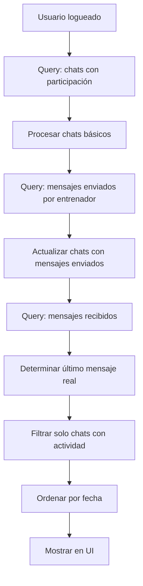

# 🔄 Chats Recientes - Mensajes Bidireccionales

## 🎯 Problema Solucionado

**Antes:** Solo se mostraban chats donde el entrenador había recibido mensajes  
**Ahora:** Se muestran todos los chats con actividad, incluyendo donde el entrenador envió mensajes

## ✅ Mejoras Implementadas

### 1. **Detección Bidireccional de Mensajes**
- ✅ Chats donde el entrenador recibió mensajes
- ✅ Chats donde el entrenador envió mensajes
- ✅ Combinación de ambos para último mensaje real

### 2. **Algoritmo Mejorado**
```javascript
// 1. Obtener todos los chats donde participa el entrenador
// 2. Buscar mensajes enviados por el entrenador
// 3. Buscar mensajes recibidos en esos chats
// 4. Combinar y mostrar el mensaje más reciente
// 5. Ordenar por fecha de último mensaje
```

### 3. **Datos de Prueba Realistas**
- **Ana García:** Solo mensajes recibidos (2 sin leer)
- **Carlos López:** Conversación bidireccional (entrenador respondió)
- **María Rodríguez:** Entrenador envió mensaje de felicitación

### 4. **Mejor Gestión de Estados**
```typescript
type ChatReciente = {
  // ... campos existentes
  tieneActividad: boolean; // Solo mostrar chats con mensajes reales
}
```

## 🧪 Casos de Uso Cubiertos

### Caso 1: Cliente envía mensaje
```
Cliente: "¿Cómo va mi rutina?"
Resultado: ✅ Aparece en chats recientes
```

### Caso 2: Entrenador envía mensaje
```
Entrenador: "¡Excelente trabajo hoy!"
Resultado: ✅ Aparece en chats recientes
```

### Caso 3: Conversación bidireccional
```
Cliente: "¿Podemos cambiar la hora?"
Entrenador: "Perfecto, a las 3pm"
Resultado: ✅ Muestra último mensaje (del entrenador)
```

### Caso 4: Chat sin mensajes
```
Chat creado pero sin mensajes
Resultado: ❌ No aparece (evita ruido)
```

## 🔍 Flujo de Datos



## 📊 Estructura de Datos

### Colección `chats`
```javascript
{
  participantes: ["entrenadorId", "clienteId"],
  ultimoMensaje: "Texto del último mensaje",
  fechaUltimoMensaje: timestamp,
  mensajesSinLeer: {
    "entrenadorId": 0,
    "clienteId": 2
  }
}
```

### Colección `mensajes`
```javascript
{
  chatId: "chat_123_456",
  mensaje: "Texto del mensaje",
  remitenteId: "123",
  timestamp: timestamp,
  leido: boolean
}
```

## 🚀 Cómo Probar

### 1. Datos Demo (automático)
Si no hay usuario logueado, verás 3 chats de ejemplo que simulan:
- Mensajes solo recibidos
- Conversación bidireccional 
- Mensaje enviado por entrenador

### 2. Firebase Real
1. **Crear chats:** Botón verde "Crear"
2. **Ver resultado:** Deberían aparecer 3 chats con diferentes tipos de conversación
3. **Eliminar:** Botón rojo "Borrar"

### 3. Verificar Logs
```
useChatsRecientes - Processing chat doc: chat_123_ana_garcia
useChatsRecientes - Mensajes enviados por entrenador: 2
useChatsRecientes - Updated chat with sent message: chat_123_carlos_lopez
useChatsRecientes - Final chats array: 3
```

## 🎯 Resultado Esperado

**Antes de los cambios:**
- Solo 1 chat (donde recibiste mensaje)
- Mensajes que enviaste no aparecían

**Después de los cambios:**
- 3 chats en total
- Incluye conversaciones donde solo enviaste mensajes
- Incluye conversaciones bidireccionales
- Último mensaje real (enviado o recibido)
- Ordenado cronológicamente

## 🔧 Debugging

Si no aparecen todos los chats esperados, revisar:

1. **Logs de Firebase:** Buscar "useChatsRecientes -"
2. **Colección mensajes:** Verificar que existen mensajes del entrenador
3. **Campo participantes:** Debe incluir el ID del entrenador
4. **Campo activo:** Debe ser `true`

La mejora principal es que ahora el sistema es **verdaderamente bidireccional** y muestra todas las conversaciones activas, sin importar quién envió el último mensaje.
